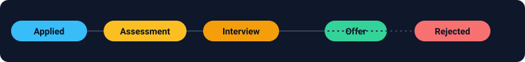

# 📮 Job Application Tracker

A cross-platform **desktop app** (Electron) that connects to your Gmail and
**automatically tracks the status of every job application** — Applied →
Assessment → Interview → Offer / Rejected — grouped by company, on one board you
can refresh anytime.

Everything runs **locally on your machine**. Your email is read with
**read-only** access, nothing is uploaded anywhere, and the app never sends,
deletes, or modifies any mail.



## Features

- **Dashboard** — animated stat tiles, a filterable/sortable application list, and
  "time to follow up" nudges for applications that have gone quiet.
- **Kanban board** — drag any application between stages to override the detected
  status; your manual changes are remembered across syncs.
- **Detail drawer** — click any application for its full email timeline, editable
  status, private notes, pin/archive, and a one-click "Open in Gmail".
- **Analytics** — pipeline funnel, status breakdown donut, applications-over-time,
  and KPIs (response rate, interview rate, offer rate, avg. time to reply).
- **Automatic background sync** with **desktop notifications** when an application
  changes status (new interview, offer, rejection…).
- **Light / dark theme**, **CSV export**, and a keyboard-friendly, fully local app.

---

## How it works

1. You connect your Gmail account once (read-only OAuth).
2. On **Sync**, the app searches your inbox for job-application mail (using a
   focused Gmail query so it never downloads your whole mailbox).
3. Each email is classified into a pipeline **stage** with a heuristic engine
   (`src/main/parser/`) and grouped per company/role.
4. The board shows each application's **current status**, when it last changed,
   and how many emails are in the thread.

The classifier and grouping logic are plain, dependency-free modules with unit
tests (`npm test`) — easy to tune or swap for an AI-backed classifier later.

---

## One-time setup: Google credentials (~5 minutes)

Gmail's API requires **your own** OAuth client. This can't be shipped inside the
app — Google ties it to your account for security. You only do this once.

1. Go to the [Google Cloud Console](https://console.cloud.google.com/) and
   create (or pick) a project.
2. **Enable the Gmail API**: APIs & Services → Library → search “Gmail API” →
   **Enable**.
3. **Configure the OAuth consent screen**: APIs & Services → OAuth consent
   screen. Choose **External**, fill in the app name/email, and under
   **Test users** add your own Gmail address. (Keeping it in “Testing” mode is
   fine — you don't need to publish it for personal use.)
4. **Create credentials**: APIs & Services → Credentials → **Create
   Credentials → OAuth client ID → Application type: _Desktop app_**.
5. Click **Download JSON**. This is your `credentials.json`.
6. Launch the app (below), click **Import credentials.json…**, and pick that
   file. Then click **Connect Gmail** and approve the read-only access.

> The scope requested is `gmail.readonly` — the minimum needed to read message
> subjects and snippets. You can revoke access anytime at
> [myaccount.google.com/permissions](https://myaccount.google.com/permissions).

Detailed Google walkthrough:
<https://developers.google.com/workspace/guides/create-credentials#desktop-app>

---

## Run it

```bash
cd job-application-tracker
npm install      # installs Electron + googleapis (first run downloads Electron)
npm start        # launches the desktop app
```

To build a distributable installer (`.dmg` / `.exe` / `.AppImage`):

```bash
npm run build    # uses electron-builder; output in dist/
```

Run the logic tests:

```bash
npm test
```

---

## Project layout

```
job-application-tracker/
├── package.json
├── src/
│   ├── main/                 # Electron main process (Node)
│   │   ├── main.js           # window + IPC handlers
│   │   ├── preload.js        # secure renderer bridge (contextIsolation)
│   │   ├── gmail/
│   │   │   ├── auth.js        # OAuth2 loopback consent flow
│   │   │   └── client.js      # Gmail search + fetch + normalize
│   │   ├── parser/
│   │   │   ├── classifier.js  # email → pipeline stage (heuristics)
│   │   │   ├── extractor.js   # email → company + role
│   │   │   └── aggregate.js   # group emails → one record per application
│   │   └── store/store.js    # local persistence (electron-store)
│   └── renderer/             # dashboard UI (sandboxed)
│       ├── index.html
│       ├── styles.css
│       └── renderer.js
└── test/parser.test.js       # unit tests for the parsing logic
```

## Pipeline stages

| Stage | Meaning | Example trigger |
| --- | --- | --- |
| **Applied** | Application received/confirmed | “We received your application” |
| **Viewed** | Recruiter opened it (e.g. LinkedIn) | “Your application was viewed” |
| **Assessment** | Coding challenge / test sent | “Complete your coding challenge” |
| **Interview** | Interview / call being scheduled | “Let's schedule a call” |
| **Offer** | Offer extended 🎉 | “We're delighted to offer you…” |
| **Rejected** | Not moving forward | “Unfortunately, we've decided…” |

When several emails exist for one company, the app resolves the **furthest**
stage; `offer` and `rejected` are terminal and stick.

---

## Privacy & security notes

- Read-only Gmail scope; the app cannot send or delete mail.
- OAuth tokens live in Electron's private per-user data directory, never in the
  project folder, and are never logged.
- No servers, no telemetry — all processing happens on your device.

## Tuning the classifier

Job-application phrasing varies. If something is mis-categorized, edit the
pattern lists in `src/main/parser/classifier.js` (stage rules) or
`src/main/parser/extractor.js` (company/role) and add a case to
`test/parser.test.js`. The modules are pure functions, so `npm test` gives fast
feedback with no Gmail connection needed.
